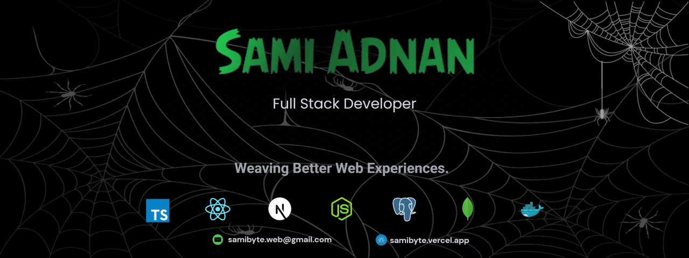

  

 

## 👋 About Me

I'm a web developer who enjoys building things that feel simple to use and solid under the hood. I like breaking down ideas, understanding how they work, and turning them into clean, dependable interfaces.

I'm early in my career, but intentional about how I grow — one project, one improvement, one solved problem at a time. I care about clarity, good design habits, and code that doesn't fight back.

Currently, I'm focused on refining my skills, learning from real-world challenges, and contributing to teams where thoughtful work truly matters.

 

## 🚀 Currently

- 🔭 Exploring **Next.js** and building server-driven React apps
- 🌱 Deepening my understanding of **TypeScript** and clean architecture
- 🛠️ Working on a **tourism website** as a personal project
- 💡 Learning to write backend APIs that are simple, secure, and easy to reason about
- 🤝 Open to collaborating on frontend-heavy or full-stack projects

 

## 🧰 Skills

**Languages**

  

**Frontend**

  

**Backend & Database**

  

**Tools & Platforms**

 

## 📊 GitHub Stats

 

 

## 💬 Random Dev Quote

 

## 🔗 Connect With Me

  
  
  

 

